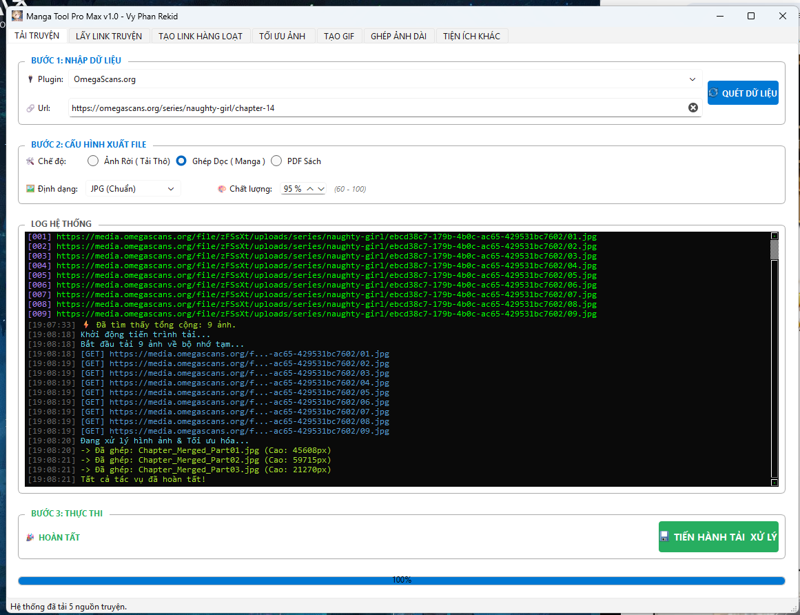
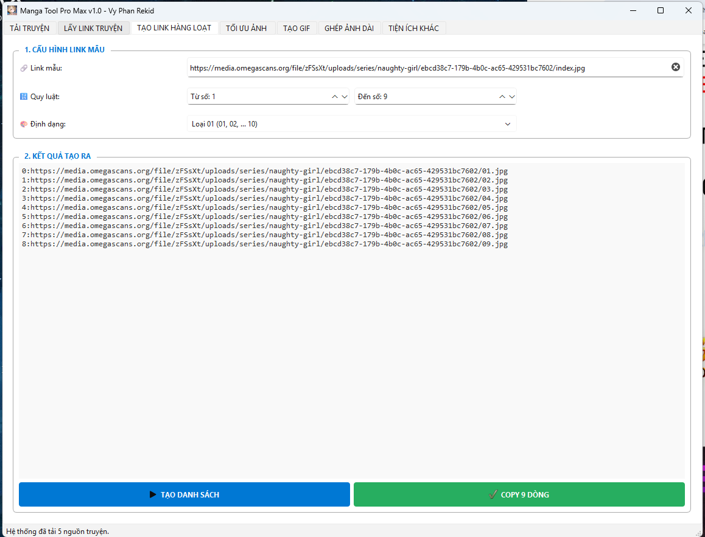
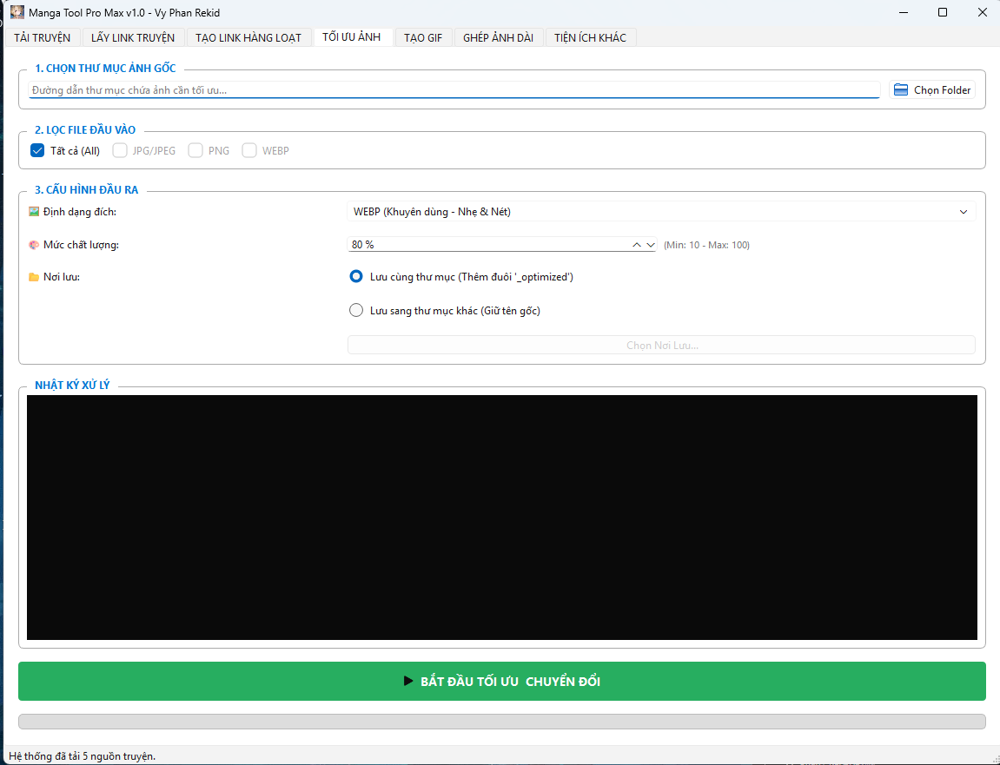

# 📚 Manga Tool Pro Max V1 - All-in-One Manga Downloader


> **Manga Tool Pro Max** là bộ công cụ tối thượng dành cho người sưu tầm truyện tranh. Hỗ trợ tải truyện từ nhiều nguồn, ghép ảnh (Long strip/Webtoon), tạo PDF, tối ưu dung lượng và tạo ảnh động GIF. Đặc biệt với kiến trúc **Modular Plugin**, bạn có thể tự thêm nguồn truyện mới mà không cần biên dịch lại phần mềm.

---

## ✨ Tính Năng Nổi Bật

| Tính Năng | Mô Tả |
| :--- | :--- |
| **📥 Tải Truyện Đa Luồng** | Tải hàng loạt ảnh cực nhanh. Hỗ trợ xuất ra **JPG**, **PNG**, **WEBP** hoặc đóng gói **PDF**. |
| **🧩 Plugin Mở** | Hệ thống **Scraper** nằm bên ngoài file chạy. Dễ dàng thêm, sửa, xóa nguồn truyện bằng file `.py`. |
| **🔗 Lấy Link (Get URL)** | Quét và trích xuất danh sách URL ảnh định dạng `index:url` để dùng cho IDM hoặc tool khác. |
| **⚡ Tối Ưu Ảnh** | Nén ảnh hàng loạt, đổi đuôi ảnh, giảm dung lượng nhưng giữ nguyên chất lượng. |
| **📜 Ghép Ảnh Dọc** | Nối các trang truyện rời thành một ảnh dài (chuẩn Webtoon/Manhwa). Tự động cắt nếu ảnh quá dài. |
| **🎞️ Tạo GIF** | Biến thư mục ảnh thành file GIF động, hỗ trợ chỉnh tốc độ (ms). |
| **🔢 Tạo Link Hàng Loạt** | Sinh link tự động theo quy luật số đếm (`index`) cho các server ảnh tĩnh. |

---

## 📸 Hình Ảnh Demo

### 1. Giao diện chính (Dashboard)


### 2. Các tính năng tải & cấu hình


### 3. Nhật ký hoạt động (Log Hacker Style)


---

## 🚀 Hướng Dẫn Cài Đặt & Sử Dụng

### 1. Dành Cho Người Dùng (User)
**Lưu ý quan trọng:** Đây là phần mềm dạng Portable (Chạy ngay).

1.  Tải file nén `.zip` hoặc `.rar` về máy.
2.  Giải nén ra một thư mục.
3.  **BẮT BUỘC:** Giữ nguyên cấu trúc thư mục. File `.exe` phải nằm cạnh thư mục `scrapers` và `assets`.
4.  Chạy file `MangaToolProMax.exe` để sử dụng.

> ⚠️ **Cảnh báo:** Không được kéo file `.exe` ra màn hình Desktop. Hãy chuột phải vào file exe -> **Send to Desktop (Create Shortcut)** nếu muốn tạo lối tắt.

### 2. Dành Cho Lập Trình Viên (Developer)
Dự án sử dụng trình quản lý gói `uv` .

```bash
# 1. Clone dự án
git clone https://github.com/username/MangaToolProMax.git
cd MangaToolProMax

# 2. Cài đặt môi trường với uv
uv sync

# 3. Chạy thử
uv run src/main.py

# 4. Đóng gói ra file EXE (Build)
uv run python -m PyInstaller --noconsole --onefile --icon="assets/logo-256x256.ico" --name="MangaToolProMax" src/main.py
```

---

## 🛠️ Hướng Dẫn Viết Plugin (Thêm Nguồn Truyện Mới)

Đây là tính năng mạnh mẽ nhất của Tool. Bạn có thể tự viết script cào dữ liệu cho trang web bất kỳ và thêm vào thư mục `scrapers/`.

### 1. Vị trí file
Tạo một file python mới (ví dụ: `nettruyen.py`) và đặt vào thư mục `scrapers/` nằm cạnh file `.exe`.

### 2. Cấu Trúc Chuẩn (Template)
Một Plugin hợp lệ bắt buộc phải kế thừa `BaseScraper` và tuân thủ cấu trúc import đặc biệt để chạy được trên cả môi trường Dev và Exe.

Dưới đây là mẫu code chuẩn (Best Practice):

```python
# --- PHẦN IMPORT BẮT BUỘC (Đừng sửa phần này) ---
try:
    # 1. Thử import tương đối (Khi chạy trong folder scrapers)
    from .base import BaseScraper
except ImportError:
    try:
        # 2. Thử import trực tiếp (Khi chạy bản exe đã build)
        import base
        BaseScraper = base.BaseScraper
    except ImportError:
        # 3. Fallback về đường dẫn source code (Khi dev)
        from src.plugins.base import BaseScraper
# ------------------------------------------------

from bs4 import BeautifulSoup

class TenTrangWebScraper(BaseScraper):
    # Tên hiển thị trên giao diện Tool
    name = "Tên Trang Web (Ví dụ: Damconuong)"
    
    # Domain để Tool tự động nhận diện khi paste link
    domain = "damconuong.onl"

    def get_images(self, soup: BeautifulSoup, url: str) -> list[str]:
        """
        Hàm logic chính để lấy link ảnh.
        :param soup: Đối tượng BeautifulSoup đã phân tích HTML của trang web.
        :param url: Đường dẫn URL hiện tại (để xử lý link tương đối).
        :return: Danh sách chứa các đường link ảnh (List[str]).
        """
        
        image_urls = []
        
        # --- VIẾT LOGIC CÀO Ở ĐÂY ---
        
        # Ví dụ: Tìm tất cả thẻ img trong div có id='chapter-content'
        # (Bạn cần F12 trên trình duyệt để xem cấu trúc web)
        for img in soup.select('#chapter-content img'):
            
            # Lấy link từ các thuộc tính thường gặp (lazyload)
            link = img.get('data-original-src') or img.get('data-src') or img.get('src')
            
            if link:
                link = link.strip()
                
                # Xử lý link thiếu giao thức (//domain.com -> https://domain.com)
                if link.startswith('//'):
                    link = 'https:' + link
                
                # Có thể thêm logic lọc ảnh rác (logo, banner...)
                if 'logo' not in link:
                    image_urls.append(link)
                    
        return image_urls
```

### 3. Quy trình thực hiện
1.  Mở trình duyệt, vào trang đọc truyện bạn muốn thêm.
2.  Nhấn **F12** hoặc **Ctrl+U** để xem mã nguồn.
3.  Tìm xem ảnh truyện nằm trong thẻ `div` nào (ví dụ: `div.reading-detail`, `div#content`...).
4.  Viết code Python sử dụng `BeautifulSoup` (như mẫu trên) để lấy list `src`.
5.  Lưu file vào folder `scrapers`.
6.  Khởi động lại App -> Nguồn mới sẽ tự hiện trong danh sách.

---

## 📂 Cấu Trúc Thư Mục (Sau khi Build)

Để phần mềm hoạt động ổn định, thư mục chứa file chạy phải đảm bảo cấu trúc sau:

```text
MangaToolPro/
│
├── MangaToolProMax.exe      # File chương trình chính
│
├── assets/                  # Thư mục chứa Icon/Logo
│   ├── icon.ico             # Icon chính
│   └── ...
│
└── scrapers/                # Thư mục chứa Plugin
    ├── __init__.py          # File rỗng (Bắt buộc)
    ├── base.py              # Class cha (Bắt buộc - Copy từ source gốc)
    ├── damconuong.py        # Plugin mẫu 1
    ├── omegascans.py        # Plugin mẫu 2
    └── ...                  # Các plugin do bạn thêm vào
```

---

## 🤝 Đóng Góp & Hỗ Trợ

Dự án được phát triển bởi **Vy Phan Rekid**.
Mọi đóng góp plugin mới hoặc báo lỗi vui lòng tạo Issue trên GitHub hoặc liên hệ trực tiếp.
